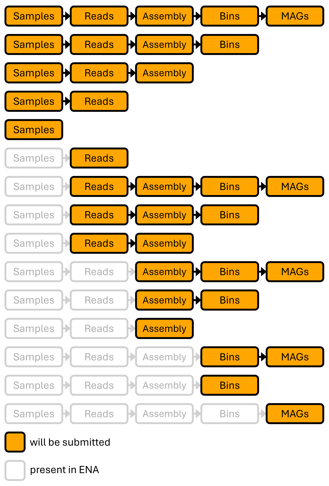

# About   

<picture>
  <source media="(prefers-color-scheme: dark)" srcset="submg/resources/logo_dark.png">
  <source media="(prefers-color-scheme: light)" srcset="submg/resources/logo_light.png">
  
</picture>

<picture>
  <source media="(prefers-color-scheme: dark)" srcset="submg/resources/nfdi4microbiota_dark.png">
  <source media="(prefers-color-scheme: light)" srcset="submg/resources/nfdi4microbiota_light.png">
  
</picture>

subMG aids in the submission of metagenomic study data to the European Nucleotide Archive (ENA). The tool can be used to submit various combinations of samples, reads, (co-)assemblies, bins, and MAGs. All files and metadata are entered in a single location, eliminating redundant data entry. subMG derives additional information where required, creates samplesheets and manifests, and uploads everything to the ENA.
A command line interface is available as well as a graphical user interface, with both offering the same functionality.
You can use subMG to continue a submission process if some levels of data already exist in ENA (e.g. submitting samples and reads through the ENA web interface, then using subMG to submit the assembly and bins).

subMG was developed within the German [NFDI4Microbiota consortium](https://nfdi4microbiota.de/) with the objective of simplifying [FAIR](https://www.go-fair.org/fair-principles/) data sharing in metagenomics and assisting microbiologists with the submission process.

  <source media="(prefers-color-scheme: dark)" srcset="submg/resources/gui_screenshot.png">
  <source media="(prefers-color-scheme: light)" srcset="submg/resources/gui_screenshot.png">
  

&nbsp;
&nbsp;
&nbsp;

Please Note
> 1. Only for *metagenomic* datasets.  
> 2. Submit bins *before* MAGs ([ENA’s MAG ≠ metagenomic bin](https://ena-docs.readthedocs.io/en/latest/submit/assembly/metagenome/mag.html#what-is-considered-a-mag-in-ena)).  
> 3. Contact the ENA helpdesk [before submitting third-party data](https://ena-docs.readthedocs.io/en/latest/submit/assembly/metagenome/mag.html#introduction).  
> 4. Report issues & suggest improvements on GitHub (see [Support](#support)). We are happy to help!

&nbsp;
&nbsp;

<picture>
  <source media="(prefers-color-scheme: dark)" srcset="submg/resources/steps_dark.png">
  <source media="(prefers-color-scheme: light)" srcset="submg/resources/steps_light.png">
  
</picture>

&nbsp;
&nbsp;

# Content
- [Installation](#installation)
  - [Installing from source (CLI & GUI)](#installing-from-source-cli--gui)
  - [GUI executable](#gui-executable)
- [Usage](#usage)
  - [CLI Tutorial](#cli-tutorial)
  - [ENA Development Service](#ena-development-service)
  - [Study Object](#study-object)
  - [The Config File](#the-config-file)
  - [Submission Modes](#submission-modes)
  - [Input Overview](#input-overview)
- [Taxonomy Assignment](#taxonomy-assignment)
  - [GTDB-Toolkit (GTDB-Tk) Taxonomy](#gtdb-toolkit-gtdb-tk-taxonomy)
  - [NCBI-Taxonomy](#ncbi-taxonomy)
  - [Taxonomy Assignment Failure](#taxonomy-assignment-failure)
  - [Manual Taxonomy File](#manual-taxonomy-file)
- [Quality Data](#quality-data)
- [MAG Submission](#mag-submission)
  - [Contig- and Chromosome-MAG-Assemblies](#contig--and-chromosome-mag-assemblies)
  - [MAG metadata](#mag-metadata)
- [Preventing Process Interruption](#preventing-process-interruption)
- [Edge Cases](#edge-cases)
  - [Dereplication](#dereplication)
  - [Bin Contamination above 100 percent](#bin-contamination-above-100-percent)
- [Support](#support)
- [Citation](#citation)

# Installation
There are three options for using subMG:
- Download the [docker container](https://hub.docker.com/r/ttubb/submg) (for CLI use)
- Download the GUI executable (for Windows and most Linux distributions, see below for hints)
- Installing from source (for CLI or GUI use, see below for instructions)

## Installing from source (CLI & GUI)
You will need the following software installed
- Python 3.8 or higher
- Java 17 or higher
- Python-Tk (optional, only needed for GUI)
- [wheel](https://pypi.org/project/wheel/) for Python

To install subMG
- Download the software
  - either download a [release](https://github.com/metagenomics/submg/releases) and untar/unzip it
  - or clone the repository via: `git clone https://github.com/metagenomics/submg/`
- Navigate into the directory you just created
- Run `python -m pip install .`
- Run `submg-cli download-webin`

You can now use `submg-cli` to run the command-line interface or `submg-gui` to run the graphical user interface.

## GUI executable
subMG requires Java 17 or higher for several submission steps. On Windows, you might use free options like [Eclipse/Adoptium](https://adoptopenjdk.net/) or [Amazon/Corretto](https://aws.amazon.com/de/corretto/). On Debian-family Linux, you might install via `sudo apt install openjdk-21-jre-headless`.
Please reach out if you have trouble running the executable on Windows or any Linux distribution.

# Usage
subMG is intended to submit data related to a *single* (co-)assembly. All samples, sequencing runs, bins and MAGs specified in the config file will be associated with this assembly. If you want to submit data from multiple assemblies, you need to run subMG once for each assembly.

## CLI Tutorial
If you'd like to use the subMG CLI, consider following [the tutorial](https://metagenomics.github.io/submg/)

## ENA Development Service
ENA provides a [development service](https://ena-docs.readthedocs.io/en/latest/submit/general-guide/interactive.html) to trial your submission before uploading your data to the production server. We strongly suggest submitting to the production server only after a test submission with identical parameters was successful. Otherwise, you might end up with incomplete or incorrect submissions, with no ability to correct or remove them. Unless `--development-service 0` is specified, subMG will always submit to the test server.

## Study Object
`Study` is used synonymously with `project` here. Before you can submit data using subMG, you need to have a `Study` object (= a project) in your ENA account. If you intend to submit annotation data, you will also need a [locus tag prefix](https://ena-docs.readthedocs.io/en/latest/faq/locus_tags.html). You can create both through the ENA webin portal on the [production server](https://www.ebi.ac.uk/ena/submit/webin/login) or the [development server](https://wwwdev.ebi.ac.uk/ena/submit/webin/login). Be aware that if you create the `Study` object on the production server, it can take up to 24 hours until it is available on the development server. This can cause test submissions to fail.

## The Config File
A lot of (meta)data is required for a submission. To use subMG, you need to provide metadata and the locations of your files in a YAML document. Which information is required depends on the type of your submission. You can use the `submg-cli makecfg` command to create a template for your config file. It will contain only the fields necessary for your specific submission, along with explanations and examples. Additionally, the `examples` directory contains examples of config files and the associated data. If you are unsure of how to fill out certain fields, please feel free to ask on the [GitHub discussions page](https://github.com/metagenomics/submg/discussions) of this project.

## Submission Modes
Not all combinations of items can be submitted. For example, it is not possible to submit only samples and a co-assembly without also submitting the corresponding reads. The figure below illustrates all possible combinations of items that can be submitted.
<picture>
  <source media="(prefers-color-scheme: dark)" srcset="submg/resources/submission_modes_dark.png">
  <source media="(prefers-color-scheme: light)" srcset="submg/resources/submission_modes_light.png">
  
</picture>

## Input Overview
This list details the kinds of files subMG ingests (depending on what items are being submitted).
- Sample submission
	- no files
- Read submission
	- `fastq` or gzipped `fastq` files
- Assembly submission
	- `fasta` or gzipped `fasta` files
	- (optional) `BAM` files for coverage calculation
- Binned contig submission
	- directory with `fasta` or gzipped `fasta` files, one for each contig
	- (optional) `BAM` files for coverage calculation
	- taxonomic information: e.g. `gtdb_to_ncbi_majority_vote.py` output, see section [Taxonomy Assignment](#taxonomy-assignment)
	- quality information: e.g. [CheckM](https://github.com/Ecogenomics/CheckM) output, see section [Quality Data](#quality-data)
- MAG submission (see [MAG submission](#mag-submission) section for details)
	- `fasta` or gzipped `fasta` or [EMBL-Flatfile](https://ena-docs.readthedocs.io/en/latest/submit/fileprep/flat-file-example.html)
	-  tab separated table with [MAG details](#mag-metadata)

# Taxonomy Assignment
Assemblies and bins need a valid NCBI taxonomy (scientific name and taxonomic identifier) for submission. For metagenome submissions, [environmental organism-level taxonomy](https://ena-docs.readthedocs.io/en/latest/faq/taxonomy.html#environmental-organism-level-taxonomy) is required.

For example, consider a bin that was classified only on the class level and was determined to belong to class `Clostridia`. The taxonomy id of the class `Clostridia` is `186801`. However, the correct environmental organism-level taxonomy for the bin is `uncultured Clostridia bacterium` with the taxid `244328`.

subMG will automatically derive environmental organism-level taxonomy when users provide regular NCBI taxonomic annotation.

## GTDB-Toolkit (GTDB-Tk) Taxonomy
If you performed taxonomic annotation of bins based on [GTDB](https://gtdb.ecogenomic.org/), you can use the `gtdb_to_ncbi_majority_vote.py` script of the [GTDB-Toolkit](https://github.com/Ecogenomics/GTDBTk) to translate your results to NCBI taxonomy. The output of `gtdb_to_ncbi_majority_vote.py` can directly be parsed by subMG.

These tables can be provided under the `NCBI_TAXONOMY_FILES` keyword in the configuration form.

## NCBI-Taxonomy
You can provide one or more tables with NCBI taxonomy information for your bins (you can find an example at `./examples/data/taxonomy/bacteria_taxonomy.tsv`). subMG will use ENA's [suggest-for-submission-endpoint](https://ena-docs.readthedocs.io/en/latest/retrieval/programmatic-access/taxon-api.html) to derive taxids that follow the [rules for bin taxonomy](https://ena-docs.readthedocs.io/en/latest/faq/taxonomy.html).

| Bin_id | NCBI_taxonomy                                                                 |
|--------|------------------------------------------------------------------------------|
| bin1   | d__Bacteria;p__Bacteroidetes;c__Bacteroidia;o__Bacteroidales;f__;g__;s__     |
| bin2   | d__Archaea;p__;c__;o__;f__;g__;s__ |
| bin3   | d__Eukaryota;p__;c__Dothideomycetes;o__Pleosporales;f__Massarinaceae;g__Helminthosporium;s__ |

These tables can be provided under the `NCBI_TAXONOMY_FILES` keyword in the configuration form.

The values in the `bin_id` field have to match the basenames of the bin fasta files (e.g. there needs to be a `bin1.fasta`, `bin1.fna` or similar in your `BINS_DIRECTORY`)

The string in the 'NCBI_taxonomy' column has to adhere to the format shown in the above example: Taxonomic ranks are separated by semicolons. On each rank, a letter indicating the rank is followed by two underscores and the classification at that rank. The ranks have to be in the order 'domain', 'phylum', 'class', 'order', 'family', 'genus', 'species'. If a classification at a certain rank is unavailable, the rank itself still needs to be present in the string (e.g. "s__" where the species taxonomy is unknown).

## Taxonomy Assignment Failure
In some cases, subMG will be unable to assign a valid taxonomy to a bin. The submission will be aborted and you will be informed which bins are causing problems. In such cases, you must determine the correct scientific name and taxid for the bin and specify it in a [manual taxonomy file](#manually-specified-taxonomy). This file then has to be referenced in the `MANUAL_TAXONOMY` field of your config. Remember to use [environmental organism-level taxonomies](https://ena-docs.readthedocs.io/en/latest/faq/taxonomy.html#environmental-organism-level-taxonomy) when manually defining the taxonomy for your bin.

A possible reason for a failed taxonomic assignment is that no proper [environmental organism-level taxonomies](https://ena-docs.readthedocs.io/en/latest/faq/taxonomy.html#environmental-organism-level-taxonomy) exist yet (this happens more often than one might expect). You can [create a taxon request](https://ena-docs.readthedocs.io/en/latest/faq/taxonomy_requests.html) in the ENA Webin Portal to register the taxon.

## Manual Taxonomy File
In cases where subMG is unable to assign a valid taxonomy based on the NCBI taxonomy file, you can provide taxonomies for some of your bins as a tab-separated table. The table has to be referenced under the keyword `MANUAL_TAXONOMY` in the configuration form. The table matches each `Bin_id` to a `Scientific_name` and a `Tax_id`. If a bin is present in this document, the taxonomic data from other sources will be ignored. Each `Bin_id` has to match the basename of binned contigs fasta file.
|Bin_id|Scientific_name|Tax_id|
|---|---|---|
|bin3|uncultured Paracoccus sp.|189685|

An example of such a document can be found in `./examples/data/taxonomy/manual_taxonomy_3bins.tsv`. Again, values in the `bin_id` field have to match the basenames of the bin fasta files (e.g. there needs to be a `bin1.fasta`, `bin1.fna` or similar matching `bin1` of your table).

ENA provides a [guideline for choosing taxonomy](https://ena-docs.readthedocs.io/en/latest/faq/taxonomy.html). You can query ENA's [suggest-for-submission-endpoint](https://ena-docs.readthedocs.io/en/latest/retrieval/programmatic-access/taxon-api.html) to find the correct taxid for a bin programmatically or directly through the browser (e.g. by navigating to https://www.ebi.ac.uk/ena/taxonomy/rest/suggest-for-submission/escherichia).

# Quality Data
Binned contigs and MAGs need to be submitted with quality data (contamination and completeness of each bin/MAG). In the `QUALITY_FILE` field of the configuration form you need to provide either the output of [CheckM](https://github.com/Ecogenomics/CheckM) / [CheckM2](https://github.com/chklovski/CheckM2) or a table with the columns `Bin_id`, `Completeness`, `Contamination`. `Completeness` and `Contamination` values represent percentages (e.g. `93.2` means 93.2%). Each `Bin_id` has to correspond to the basename of a MAG or binned contigs fasta file. Fields have to be tab-separated. An example of a valid table is seen below.
|Bin_id|some_other_column|Contamination|Completeness|
|------|-----------------|-------------|------------|
|bin15 | other data      | 3.14        | 92.91      |
|bin17 | other data      | 14.29       | 44.32      |

Please consult the [Edge Cases](#edge-cases) section for bins with more than 100% contamination.

# MAG Submission
If you have assembled high-quality bins from your metagenome, you can [submit them as MAGs](https://ena-docs.readthedocs.io/en/latest/faq/metagenomes.html#) (after submitting them as bins). Some additional metadata is needed for a MAG submission.

## Contig- and Chromosome-MAG-Assemblies
A MAG assembly can be submitted either as a 'Contig Assembly' or a 'Chromosome Assembly'. Please consult [the ENA documentation for further information](https://ena-docs.readthedocs.io/en/latest/submit/assembly/metagenome/mag.html#stage-2-prepare-the-files). You will need to provide additional data for a Chromosome Assembly submission (see below).

## MAG metadata
If you are submitting MAGs, you need to provide a .tsv file and specify it in the `MAGS_METADATA_FILE` field of your config file. The file needs to have the columns `Bin_id`, `Sample_id`, `Quality_category`, `Flatfile_path` and `Unlocalised_path`. An example of a `MAGS_METADATA_FILE` can be found in `./examples/data/mags/mags_metadata.tsv`.
Depending on your submission, not all columns have to be filled out.
- `Bin_id`: Identifier of the bin. Has to be identical to the identifier used in the name of the fasta file, the taxonomy .tsv files etc.
- `Quality_category`: 'finished', 'high' or 'medium' as defined by ENA [here](https://ena-docs.readthedocs.io/en/latest/faq/metagenomes.html) (note the requirements regarding RNA sequences for the 'high' and 'finished' categories).
- `Flatfile_path`: For chromosome assemblies only. Either a `.fasta` file or an [EMBL-Flatfile](https://ena-docs.readthedocs.io/en/latest/submit/fileprep/flat-file-example.html) can be [used for MAG submission](https://ena-docs.readthedocs.io/en/latest/submit/fileprep/assembly.html#flat-file). If you leave the field empty, the `.fasta` file of the corresponding bin will be used. If you want to provide annotation data, you need to provide a path to a flatfile. [EMBLmyGFF3](https://github.com/NBISweden/EMBLmyGFF3) provides a convenient way to create flatfiles based on your annotation data.
- `Unlocalised_path`: For chromosome assemblies only. Optional. [Path to a .txt file containing the unlocalised contigs of the bin](https://ena-docs.readthedocs.io/en/latest/submit/fileprep/assembly.html#unlocalised-list-file).

Using the table below, MAG `m1` will be submitted as a medium quality contig assembly without annotation. `m2` will be submitted as a high quality contig assembly and include annotation. MAG `m3` will be submitted as a finished chromosome assembly, including annotation. 
|Bin_id|Quality_category|Flatfile_path|Chromosomes_path|Unlocalised_path|
|---|---|---|---|---|
|m1|medium||||
|m2|high|/path/to/m2_flatfile.tsv|||
|m3|finished|/path/to/m3_flatfile.tsv|/path/to/m3_chromosome.txt|/path/to/m3_unlocalised.txt|

# Preventing Process Interruption
A submission can take several hours to complete. We recommend using [nohup](https://en.wikipedia.org/wiki/Nohup), [tmux](https://github.com/tmux/tmux/wiki) or something similar to prevent the submission process from being interrupted. 

# Edge Cases

## Dereplication
If your bins are the result of dereplicating data from a single assembly, you can use subMG as described above. If your bins are the result of dereplicating data from multiple different assemblies, you need to split them based on which assembly they belong to. You then run subMG separately for each assembly (together with the corresponding set of bins).

## Bin Contamination above 100 percent
When calculating completeness and contamination of a bin with tools like [CheckM](https://github.com/Ecogenomics/CheckM), contamination values above 100% can occur. [Usually, this is not an error](https://github.com/Ecogenomics/CheckM/issues/107). However, the ENA API will refuse to accept bins with contamination values above 100%. subMG will automatically exclude bins with contamination values above 100% from the submission.
If you absolutely need to submit such (presumably low-quality) bins, you need to manually set their contamination value to 100 in the 'QUALITY_FILE' you provide under the bins section.

# Support
subMG is being actively developed. Please use the GitHub [issue tracker](https://github.com/metagenomics/submg/issues) to report problems. A [discussions page](https://github.com/metagenomics/submg/discussions) is available for questions, comments and suggestions. 

# Citation
When using subMG in your work, please cite https://doi.org/10.1186/s13040-025-00453-wd